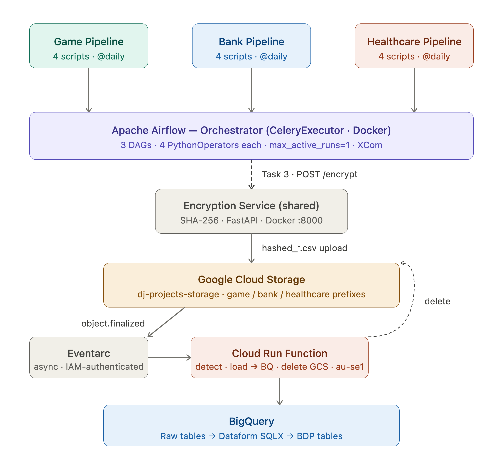
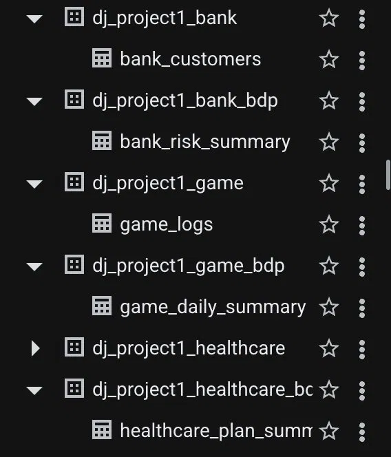
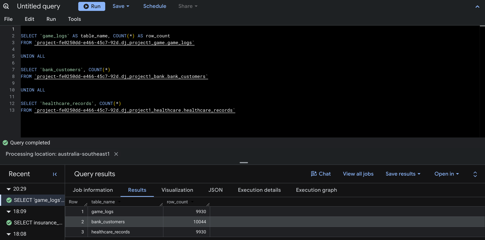
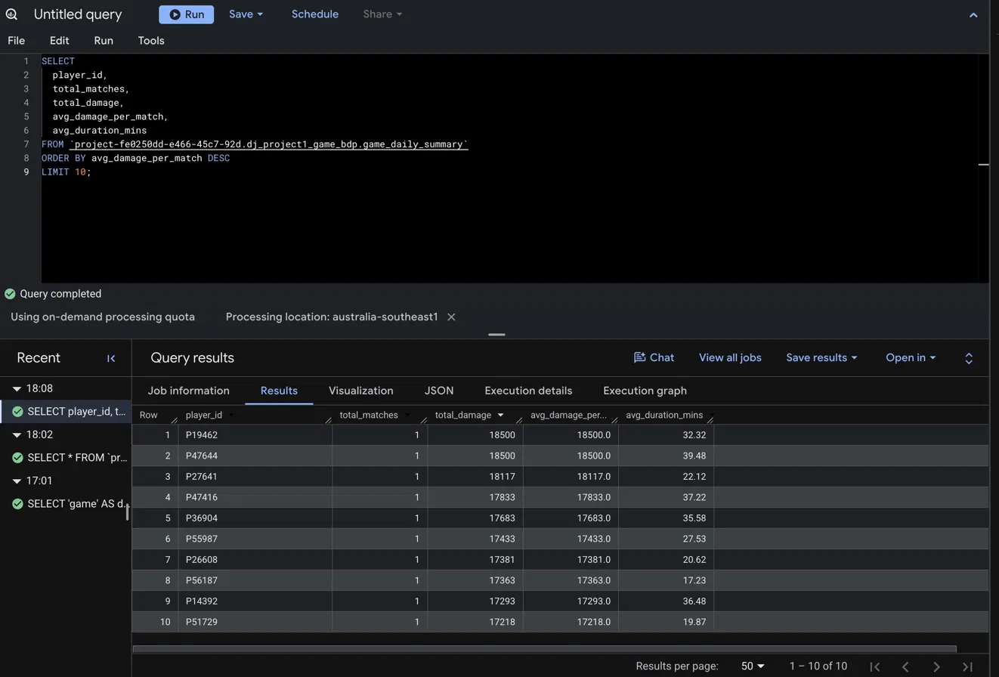
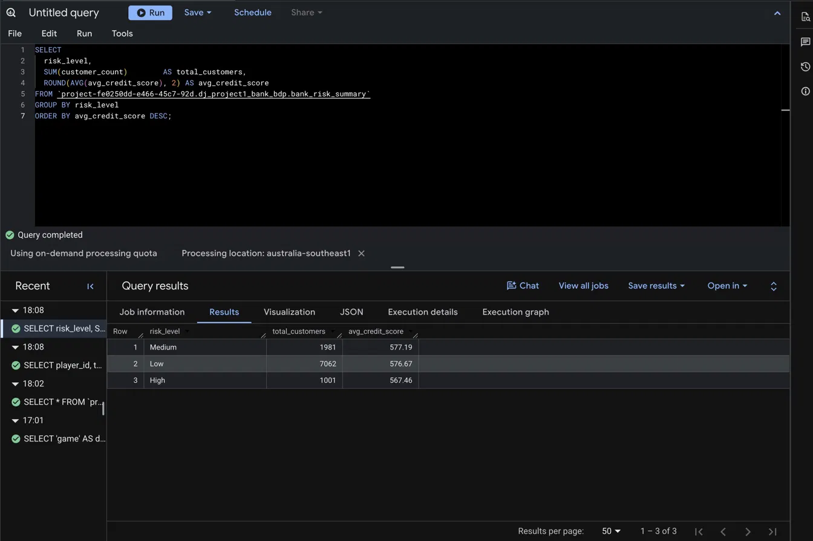
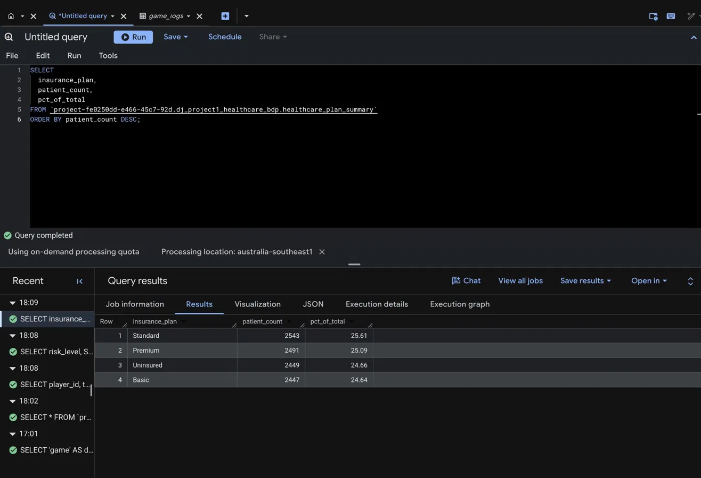
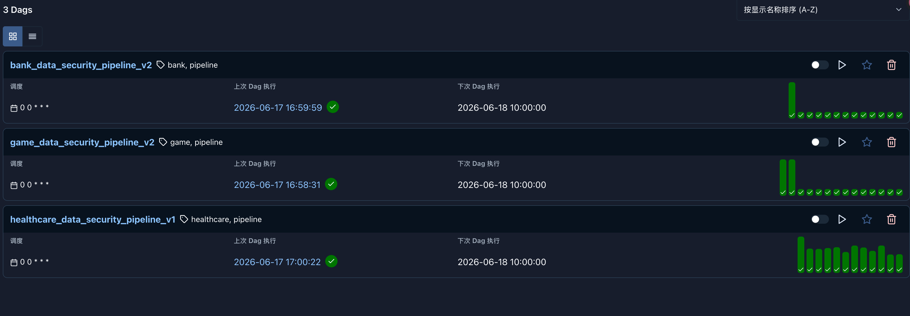

# GCP End-to-End Secure Data Pipeline

A multi-domain batch data pipeline built on Google Cloud Platform, simulating enterprise ETL workflows across three business domains: **Gaming**, **Banking**, and **Healthcare**.

Apache Airflow orchestrates daily pipelines that generate, hash, and upload mock data to Google Cloud Storage. A Cloud Run Function automatically routes each file into the correct BigQuery dataset via Eventarc triggers. Raw data is then transformed into Business Data Products using Dataform SQLX.

---

## Architecture Overview



---

## Tech Stack

| Layer | Technology |
|---|---|
| Orchestration | Apache Airflow 3.2.1 (CeleryExecutor, Docker) |
| Field-level hashing | SHA-256 via FastAPI microservice (Docker) |
| Cloud storage | Google Cloud Storage |
| Event trigger | Google Eventarc (object.finalized) |
| Serverless routing | Google Cloud Run Functions (Python 3.11) |
| Data warehouse | Google BigQuery |
| Transformation | Dataform SQLX (Dataform Core 3.0.52) |
| Language | Python 3.x |

---

## Pipeline Design

Each domain runs an identical 4-task Airflow DAG on a `@daily` schedule:

```
Task 1 — generate_landing_data
    Generate 900–1,100 rows of mock domain data
    Write CSV to data/1_landing/

Task 2 — move_data_to_staging
    Move CSV from landing/ to staging/
    Filter hidden files · dual try/except

Task 3 — encrypt_and_upload_to_gcs
    POST sensitive fields to shared SHA-256 hashing service
    Write hashed CSV to /tmp/ · upload via GCSHook
    Destination: gs://dj-projects-storage/project1/{domain}_data/

Task 4 — archive_staging_data
    Move original (unhashed) CSV to archive/
    Per-file OSError → skip and continue
```

After Task 3 uploads to GCS, **Eventarc fires asynchronously** (independent of Task 4):

```
GCS object.finalized
    → Eventarc trigger
    → Cloud Run Function (project1-gcs-to-bq-router)
        → detect_domain()       reads GCS path prefix
        → load_csv_to_bigquery() insert_rows_json · WRITE_APPEND
        → delete_gcs_file()     removes file after successful write
    → BigQuery raw table
    → Dataform SQLX transform → BDP table
```

For the full step-by-step execution logic including all decision branches and retry paths, see:
- [Dataflow Diagram](image/gcp_dataflow_diagram_v2.png)
- [Logic Flow Diagram](image/gcp_logic_flow_v6_final.png)

---

## Domain Details

### Gaming
- **Data model:** match-level event log
- **Sensitive field hashed:** `match_id`
- **Raw table:** `dj_project1_game.game_logs`
- **BDP table:** `dj_project1_game_bdp.game_daily_summary` — daily aggregation of damage dealt and match duration per player

### Banking
- **Data model:** SCD Type 2 (slowly changing dimension) customer records
- **Sensitive field hashed:** `customer_id`
- **Raw table:** `dj_project1_bank.bank_customers`
- **BDP table:** `dj_project1_bank_bdp.bank_risk_summary` — customer count and average credit score by risk level and account tier

### Healthcare
- **Data model:** SCD Type 2 patient records with Australian locale (Faker `en_AU`)
- **Sensitive fields hashed:** `patient_uuid` + `medicare_number`
- **Raw table:** `dj_project1_healthcare.healthcare_records`
- **BDP table:** `dj_project1_healthcare_bdp.healthcare_plan_summary` — patient distribution and percentage share by insurance plan

---

## Project Structure

```
gcp-end-to-end-secure-data-pipeline/
├── airflow_dags/
│   ├── bank_data_pipeline_dag.py
│   ├── game_data_pipeline_dag_v2.py
│   └── healthcare_data_pipeline_dag.py
├── cloud_functions/
│   ├── main.py                         # Central Router — detect, load, delete
│   └── requirements.txt
├── dataform/
│   ├── bank_risk_summary.sqlx
│   ├── game_daily_summary.sqlx
│   └── healthcare_plan_summary.sqlx
├── scripts/
│   ├── bank_scripts/
│   │   ├── bank_generate.py
│   │   ├── bank_moveto_staging.py
│   │   ├── bank_upload_encrypted_gcs.py
│   │   └── bank_archive.py
│   ├── game_scripts_v2/
│   │   ├── game_generate_v2.py
│   │   ├── game_moveto_staging_v2.py
│   │   ├── game_upload_encrypted_gcs_v2.py
│   │   └── game_archive_v2.py
│   └── healthcare_scripts/
│       ├── healthcare_generate.py
│       ├── healthcare_moveto_staging.py
│       ├── healthcare_upload_encrypted_gcs.py
│       └── healthcare_archive.py
├── image/
│   ├── architecture_overview_v2.png
│   ├── airflow_screenshot.png
│   ├── bq-1.png
│   ├── bq-2.png
│   ├── analyse-game.png
│   ├── analyse-bank.png
│   └── analyse-healthcare.png
└── .gitignore
```

---

## DAG Configuration

All three DAGs share the same configuration standards:

| Setting | Value |
|---|---|
| Schedule | `@daily` |
| `catchup` | `False` |
| `max_active_runs` | `1` |
| Retry attempts | 3 |
| Retry delay | 5 minutes |
| Operator | `PythonOperator` |
| Return values | Stored in Airflow XCom |

---

## Shared Encryption Service

All three pipelines call a single SHA-256 hashing microservice running as a separate Docker container on the same Docker network (`airflow_davy_default`).

```
POST http://encryption-service:8000/encrypt
Body: {"data": ["value1", "value2", ...]}
Response: {"result": ["hash1", "hash2", ...]}
```

This design centralises sensitive field handling and avoids duplicating hashing logic across pipelines — consistent with enterprise microservice patterns.

---

## BigQuery — Raw Tables





| Table | Rows |
|---|---|
| `dj_project1_game.game_logs` | 9,930 |
| `dj_project1_bank.bank_customers` | 10,044 |
| `dj_project1_healthcare.healthcare_records` | 9,930 |

---

## Dataform — BDP Tables

SQLX files are in the [`dataform/`](dataform/) directory. Each file targets a dedicated `_bdp` dataset and reads directly from the corresponding raw table using its full project path.

Key SQL techniques used: window functions (`SUM() OVER ()`), SCD Type 2 filtering (`end_date = '9999-12-31'`), and date truncation for daily aggregation.

---

## Sample Query Results

**Gaming — top 10 players by average damage (game_daily_summary)**



**Banking — customer distribution by risk level (bank_risk_summary)**



**Healthcare — patient count by insurance plan (healthcare_plan_summary)**



---

## Airflow — DAG Runs

All three DAGs running successfully with green status.



---

## Code Standards

All scripts follow consistent production-grade standards:

- **Paths:** environment variables via `.env` + `python-dotenv` (dual `.env` / `.env.local` pattern for Docker vs local)
- **Logging:** `logging` module throughout — no `print` statements
- **Error handling:** dual `try/except` — outer `Exception` + per-file `OSError`
- **Hidden files:** filtered via `not f.startswith('.')`
- **Return values:** all functions return `int` (file count) or `str` (file path) for XCom
- **Concurrency:** `max_active_runs=1` prevents race conditions between scheduled and manual runs
- **Secrets:** `.env`, `*.json`, `__pycache__` excluded via `.gitignore`

---

## GCP Configuration

| Resource | Value |
|---|---|
| GCS Bucket | `dj-projects-storage` |
| Cloud Run Function | `project1-gcs-to-bq-router` |
| Region | `australia-southeast1` |
| Eventarc trigger | `google.cloud.storage.object.v1.finalized` |
| Authentication | IAM (Require authentication) |
| Min instances | 0 (cost-optimised) |
| Dataform repository | `dj-project1-dataform` |
| Dataform workspace | `dev` |
